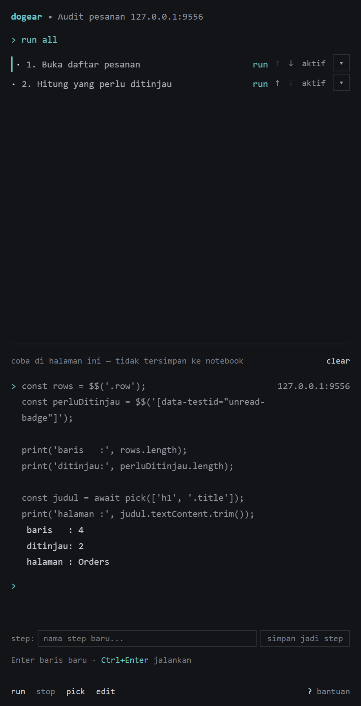
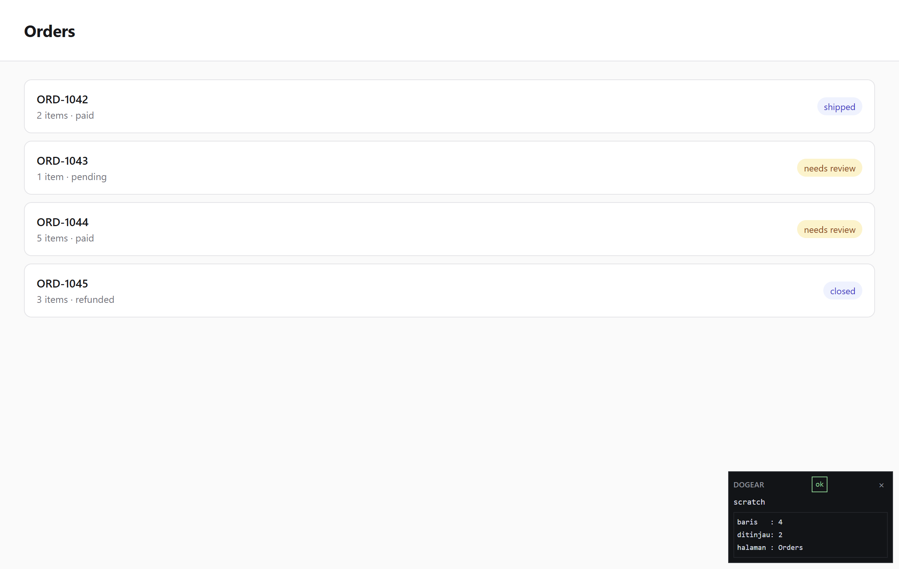

<h1 align="center">dogear</h1>

<p align="center">
  <strong>Write, run and debug browser automation one step at a time — from a side panel, on the page you are actually looking at.</strong>
</p>

<p align="center">
  
  
  
</p>

<p align="center">
  
</p>

---

## What it is

dogear is a Chrome extension that turns a web page into a notebook. You open a side panel, type a
step, and run it against the live page — the same way you would in a Jupyter cell, except the cell
runs inside the tab you are looking at. Steps are ordinary `.js` files; a notebook is a folder of
them plus a small markdown index.

It is meant for the boring, brittle work: "open this list, filter it, count what is unread, tell me
what changed" — written once, re-run later, and readable by the person who has to fix it in three
months.

> dogear continues the work previously published as **nb-steprunner**. Same author, same engine,
> new name and a rewritten extension. If you arrived from a CV or portfolio entry naming
> nb-steprunner, this is that project.

---

## What is actually hard in here

Most "run my script on a page" tools stop working the moment a real site defends itself. The parts
below are where the effort went.

**Running code on pages that block `eval`.** The usual trick — `eval`, `new Function`, or a `blob:`
script — dies under a strict Content-Security-Policy. dogear executes through
`chrome.userScripts`, which is not subject to the page's CSP. This was not assumed; it was
measured across a matrix of **8 CSP policies × 2 execution worlds × 4 probes = 64 cells**, and you
can re-run that matrix yourself (see [Reproducing the CSP measurement](#reproducing-the-csp-measurement)).

**Steps are real ES modules, not pasted text.** A notebook can `import` shared helpers from its own
files. Modules are linked before execution, and stack traces still point at *your* file and line
(`steps/03-report.js:5:12`) instead of at a generated bundle.

**State survives navigation.** A step can commit a checkpoint and then let the page navigate; the
next step resumes with `ctx.data` intact. Cross-document reach — including cross-domain iframes —
was measured rather than hoped for.

**A native-messaging bridge that respects the 1 MiB wall.** Chromium kills a native port outright
if a single message exceeds **1,048,576 bytes** (measured: 1,048,576 passes, 1,048,640 kills the
port). Outgoing messages are therefore split, and the size is measured on the **encoded envelope**,
not the raw fragment, so escaping cannot push a frame over the line. A quote-dense payload splits
into 7 frames, largest **999,989 bytes**, reassembled and verified byte-for-byte by SHA-256 through
a real host process. `bun run test` exercises this end to end.

**Timing in background tabs, measured.** A step built from `sleep()` runs ~**14.7×** slower in a
background tab; a step that waits for the DOM with `pick()` runs only ~**1.35×** slower (15 runs per
cell, no debugger attached). That single number is why the helper API pushes you toward waiting for
elements instead of sleeping.

---

## Install

No build required if you grab a release.

**From a release**

1. Download the `dogear-chrome-mv3-*.zip` asset from
   [Releases](https://github.com/afrizagilleon/dogear/releases) and unzip it.
2. Open `chrome://extensions`, turn on **Developer mode** (top right).
3. Click **Load unpacked** and select the unzipped folder.
4. On the **dogear** card, click **Details** and turn on **Allow user scripts**.
   This toggle is off by default since Chrome 138 and there is no API to turn it on —
   **without it, no step can run.**
5. Click the dogear toolbar icon to open the side panel.

**From source**

```bash
bun install
bun run build          # output in .output/chrome-mv3
```

Then follow steps 2–5 above, selecting `.output/chrome-mv3`.

---

## First run

1. Open any page you want to poke at.
2. Open the side panel and type into the scratch box:

```js
const el = await pick(['h1', '.title']);
print(el.textContent.trim());
```

3. Run it. The result appears in the panel; the element you matched is reported along with *which*
   candidate matched, so you can see when a site has shifted under you.

<p align="center">
  
</p>

Both images above are generated, not posed — `bun run screenshot` launches Chrome against a
profile that has the extension installed, seeds a demo notebook, runs the step and captures the
result, so they cannot drift away from what the code actually does.

Turning that into a notebook step, and the full list of the seventeen helpers available inside a
cell, is documented in **[SINTAKS.md](SINTAKS.md)** *(written in Indonesian)*.

---

## What it cannot do

Stated plainly, because a tool that hides its edges wastes your afternoon.

- **Chrome / Chromium only.** A Firefox MV3 build compiles, but Firefox does not expose
  `chrome.userScripts`, which is the entire execution path. Nothing will run there yet.
- **The "Allow user scripts" toggle is manual.** It cannot be enabled programmatically, so every
  install needs that one human click.
- **Synthetic keyboard events only.** `press()` reaches the page's own JavaScript listeners, but
  events carry `isTrusted: false` — `Ctrl+C` does not touch the clipboard and `Tab` does not move
  focus. Anything relying on native browser behaviour is out of reach.
- **A synchronous `while (true) {}` cannot be stopped.** Cancellation happens at `await` points.
- **Notebooks live in the extension's private storage (OPFS).** They are not files you can open in
  your editor yet, and they do not sync between machines.
- **No scheduler, no queue, no dashboard.** dogear runs steps; deciding *when* to run them is
  somebody else's job.
- **No claims about evading bot detection.** It automates a browser you are already logged into.
  That is all it does, and it is not designed to look like anything other than what it is.

---

## Reproducing the CSP measurement

The CSP claim above is the one most worth distrusting, so it is the one you can re-run:

```bash
bun run measure:worlds
```

It serves a local fixture under eight different `Content-Security-Policy` headers, injects four
probes into each of the two execution worlds, and writes the full 64-cell matrix to
`FINDINGS-M2.json`. The harness itself is in
[`extension/testing/csp-harness.ts`](extension/testing/csp-harness.ts) — the policies are not
hard-coded results, they are real response headers.

Reference run: Chrome/151.0.7922.174, 64/64 cells recorded.

---

## Development

```bash
bun install
bun run typecheck:ext     # no `any` in production code
bun run test              # 282 unit tests
bun run lint
bun run check:layers      # architectural boundaries
bun run check:protocol-keys
bun run build && bun run check:manifests && bun run check:runtime
```

`check:runtime` is worth a word: the extension has two build targets. The full build carries the
panel and editor; the `runtime` build is background-only, for embedding the engine without any UI.
That gate fails if a single byte of panel code leaks into the runtime bundle.

### Layout

```
extension/
  kernel/      step execution, in-page helpers, checkpoints, selector candidates
  project/     notebook parsing, ES-module linking, storage backends
  platform/    per-browser adapters (injection, storage, tabs, native port)
  native/      native-messaging bridge: framing, outgoing split, run isolation
  ui/          side panel and editor (Preact)
  entrypoints/ background service worker, side panel, editor
```

---

## License

MIT — see [LICENSE](LICENSE).
